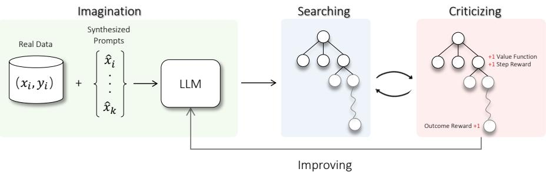
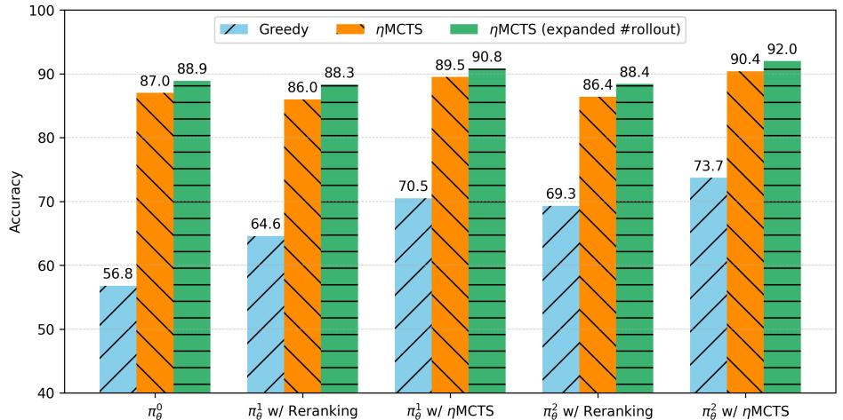
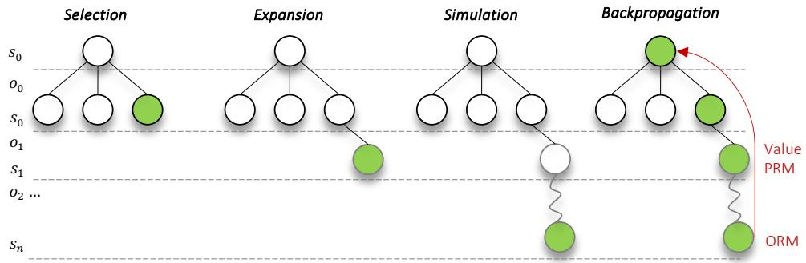

# Toward Self-Improvement of LLMs via Imagination, Searching, and Criticizing

Ye Tian1,2∗ , Baolin Peng1∗ , Linfeng Song1∗ , Lifeng Jin1 , Dian Yu1 , Lei Han2 Haitao Mi1†, Dong Yu1 1Tencent AI Lab, Bellevue, WA 2Tencent Robotics X {baolinpeng,lfsong,lifengjin,yudian,haitaomi,dyu}@global.tencent.com {yaptian,lxhan}@tencent.com

# Abstract

Despite the impressive capabilities of Large Language Models (LLMs) on various tasks, they still struggle with scenarios that involves complex reasoning and planning. Self-correction and self-learning emerge as viable solutions, employing strategies that allow LLMs to refine their outputs and learn from self-assessed rewards. Yet, the efficacy of LLMs in self-refining its response, particularly in complex reasoning and planning task, remains dubious. In this paper, we introduce ALPHALLM for the self-improvements of LLMs, which integrates Monte Carlo Tree Search (MCTS) with LLMs to establish a self-improving loop, thereby enhancing the capabilities of LLMs without additional annotations. Drawing inspiration from the success of AlphaGo, ALPHALLM addresses the unique challenges of combining MCTS with LLM for self-improvement, including data scarcity, the vastness search spaces of language tasks, and the subjective nature of feedback in language tasks. ALPHALLM is comprised of prompt synthesis component, an efficient MCTS approach tailored for language tasks, and a trio of critic models for precise feedback. Our experimental results in mathematical reasoning tasks demonstrate that ALPHALLM significantly enhances the performance of LLMs without additional annotations, showing the potential for self-improvement in LLMs. The code is available at <https://github.com/YeTianJHU/AlphaLLM>.

# 1 Introduction

LLMs, trained on trillions of tokens with billions of parameters have shown unparalleled capabilities in a wide range of natural language processing tasks [\(Touvron et al., 2023b;](#page-12-0) [Team et al., 2023;](#page-12-1) [OpenAI, 2023\)](#page-11-0). Nevertheless, they continue to face challenges in scenarios requiring complex reasoning and strategic planning [\(Valmeekam et al., 2022;](#page-13-0) [Stechly et al., 2024\)](#page-12-2). While advanced prompting approaches such as Chain, Tree, Graph-of-Thought [\(Wei et al., 2022;](#page-13-1) [Yao et al., 2024;](#page-13-2) [Besta et al., 2024;](#page-10-0) [Ding et al., 2023\)](#page-10-1), it remains essential to fine-tune LLMs using a substantial volume of high-quality, supervised data to fundamentally improve the model performance [\(Nye et al.,](#page-11-1) [2021;](#page-11-1) [Lewkowycz et al., 2022;](#page-11-2) [Chung et al., 2022\)](#page-10-2). This methodology is inherently limited by the scope and quality of data that humans can provide.

Considering these challenges, the concept of self-correction and self-learning have been proposed as promising solutions [\(Madaan et al., 2024;](#page-11-3) [Saunders et al., 2022;](#page-12-3) [Chen et al., 2024\)](#page-10-3). Within these framework, LLMs typically operate by employing two main strategies: 1) they continuously refine

#### 38th Conference on Neural Information Processing Systems (NeurIPS 2024).

∗Equal Contribution; †Corresponding Author

Figure 1: Imagination-Searching-Criticizing self-improvement loop: Imagination component synthesizes prompts as new learning examples, with MCTS searching better trajectories guided by signals from critics for policy improving.

their responses based on the feedback of their past responses, and 2) they extensively sample responses then learn from preferences judged by itself as reward models with PPO or DPO [\(Yuan et al., 2024a](#page-13-3)[,b;](#page-13-4) [Chen et al., 2024\)](#page-10-3). However, it remains a matter of ongoing research whether LLMs can effectively critique their own outputs to either enhance response quality or apply a scalar reward to indicate the quality of responses, especially in contexts demanding intricate planning and reasoning [\(Valmeekam](#page-13-0) [et al., 2022;](#page-13-0) [Stechly et al., 2024;](#page-12-2) [Huang et al., 2023;](#page-11-4) [Hong et al., 2023\)](#page-11-5). On the other hand, advanced search algorithms such as MCTS, combined with reinforcement learning, have enabled models to learn from self-play and achieve human parity or even surpass human performance in complex tasks such as the game of Go [\(Silver et al., 2016,](#page-12-4) [2017\)](#page-12-5). This naturally raises a question: is it viable to leverage the strengths of MCTS alongside LLMs to inaugurate a novel paradigm of self-improving? More precisely, could the assimilation of MCTS empower LLMs to more effectively explore better responses, guided by strategic signals, and subsequently optimize these responses to enhance overall performance?

To answer this question, we begin with a systematic examination of AlphaGo, identifying three critical aspects for its success: (*i*) The large volume of data, including self-play data. (*ii*) The use of tree search, which facilitates the exploration of potential moves through statistical sampling of the large search space. (*iii*) Accurate and unambiguous environment feedback; the direct and accurate feedback (win or loss) provided by the game of Go offers a clear and unequivocal learning signal [\(Silver et al., 2017\)](#page-12-5). The integration of MCTS with LLMs for self-improvement has several challenges: (*i*) Limited Data: High-quality annotated data for LLMs is generally scarce. Furthermore, how to construct of synthetic data for LLMs training, similar to AlphaGo's self-play data, remains unclear. (*ii*) Search Efficiency: The vast number of potential token combinations in natural language tasks results in an exponentially large search space, posing a significant challenge to the efficiency of MCTS [\(Ramamurthy et al., 2022\)](#page-12-6). (*iii*) Imperfect Feedback: In contrast to the clear win/loss feedback in Go, feedback in natural language tasks is often subjective and nuanced, without a straightforward measure of success.

In this paper, we introduce ALPHALLM, an imagination-searching-criticizing framework designed for the self-improvement of LLMs . ALPHALLM consists of three key components, as illustrated in Figure [1.](#page-1-0) First, an imagination component is designed to synthesize prompts, alleviating the issues of data scarcity. Second, we propose ηMCTS tailored for efficient searching in language tasks. Particularly, it has been show that planning at multiple levels of temporal abstraction is critical for RL problems with a long horizon and large action space [\(Sutton et al., 1999b;](#page-12-7) [Peng et al., 2017;](#page-11-6) [Luketina](#page-11-7) [et al., 2019\)](#page-11-7). As such, we propose formulating the text generation process as options over a Markov Decision Process (MDP) problem, where each option represents the generation of a collection of tokens for a specific subtask, similar to the concept of chains in chain-of-thought prompting. This formulation improves search efficiency by substantially reducing the search depth. Additionally, we propose the use of state merge and adaptive branching factors to further enhance search efficiency by balancing the trade-off between search width and depth. Lastly, since accurate feedback is crucial to the success of MCTS, we introduce a trio of critic models to guide ηMCTS, including a value function for estimating expected rewards, a process reward model for assessing node correctness, and an outcome reward model for evaluating the overall trajectory. For complex tasks with which LLMs struggle assessing such as arithmetic computation and code execution, to ensure the accuracy

of feedback, we augment the critics with the capacity to make dynamic decisions on which tools to use, when to use them, and how to use them effectively. After ηMCTS stage, we collect the trajectory with the largest reward from the critic models as the training examples to improve LLMs.

The experimental results on mathematical reasoning tasks demonstrate that ALPHALLM can efficiently search for better responses and use them to improve LLMs' performance, forming an effective self-improving loop. Notably, based on Llama-2-70b and WizardMath-70B-V1.0, ALPHALLM can improve its performance from 57.8 to 92.0 on GSM8K and from 20.7 to 51.0 on MATH, performing comparably to GPT-4.

# 2 Related Work

Search with LLM Effective search strategy has been shown crucial for tasks that involve complex reasoning and planning, such as go [\(Silver et al., 2016\)](#page-12-4) and math reasoning [\(Cobbe et al., 2021;](#page-10-4) [Hendrycks et al., 2021\)](#page-11-8). For math reasoning tasks, various search methods have been studied. One direction of research [\(Zhu et al., 2024;](#page-13-5) [Xie et al., 2024\)](#page-13-6) designed beam search with dynamic pruning, where beam items of low quality are pruned. Another line of work [\(Yao et al., 2024;](#page-13-2) [Long, 2023;](#page-11-9) [Besta et al., 2024;](#page-10-0) [Hao et al., 2023;](#page-11-10) [Feng et al., 2023\)](#page-10-5) maintains a tree or a graph that represents the current progress of solving the input question where potential branches are iteratively expanded. Both our approach and [Feng et al.](#page-10-5) [\(2023\)](#page-10-5) are based on the MCTS algorithm, while one main difference is how to define a search step: [Feng et al.](#page-10-5) [\(2023\)](#page-10-5) fix a search step to be either a token or a sentence, while our approach is more flexible on deciding steps. We have also carefully designed the MCTS process, incorporating multiple critique signals to guide the search more effectively and introducing adaptive search parameters for improved state exploration. As the result, our approach achieves much better performances.

LLM Self-improving Being a key to the success of scalable oversight [\(Bowman et al., 2022\)](#page-10-6), self-improving for LLM aims to align the LLM to human preference and values mainly using the supervision from the knowledge inside the LLM [\(Zelikman et al., 2022,](#page-13-7) [2024\)](#page-13-8). One crucial part of self-improving is how to obtain reliable signal of critique to distinguish between good responses from the LLM and bad ones. Initial work [\(Bai et al., 2022;](#page-10-7) [Wang et al., 2022\)](#page-13-9) first asks the LLM to generate input queries of diverse tasks and the corresponding outputs. They then rely on hand-crafted heuristic rules to filter out redundant or low-quality data pairs (e.g. the query is too long or too short). Since it is non-trivial to compose effective heuristic rule, later work [\(Sun et al., 2023;](#page-12-8) [Li et al.,](#page-11-11) [2023;](#page-11-11) [Guo et al., 2024\)](#page-10-8) proposes a few general principles or judging criteria and ask the LLM itself to evaluate the quality its responses based on these guidance, hoping that LLMs can automatically designate these principles into each data point to better guide data filtering. However, this requires LLMs to have strong abilities to apply these principles for each specific case and make correct judgements. Different from previous work, we propose to leverage the supervision from MCTS for LLM self-improvement: taking the outputs of MCTS to continue train the LLM. This is because the outputs from MCTS are usually in much better quality then standard nucleus sampling, and the large gap ensure that the LLM can self improve.

# 3 Preliminaries

# 3.1 Problem Formulation

In this paper, we consider a LLM characterized by probability pθ and denoted as policy πθ. It takes a sequence x = [x1, · · · , xn] as input, which is typically referred as prompt, to generate the response y = [y1, · · · , ym]. In the context of LLMs, each xi and yi represents a token from a pre-defined vocabulary. The policy πθ operates in an autoregressive manner, where each token is generated sequentially, relying solely on the context provided by the previously generated tokens. The policy therefore constitutes a Markov process in which the conditional probability distribution pθ(y|x) can be decomposed and expressed with the chain rule as pθ(y|x) = Qm i=1 pθ(yi |x, y<i).

With this property, the text generation task can be formulated as an Markov Decision Process (MDP) problem consisting of (S, A, T, R, γ) in which, st ∈ S represents the context information of current trajectory, *i.e.,* current status of the generation process, *e.g.,* a partial response to a prompt; at ∈ A denotes a single action or sampled token from the vocabulary, leading to a transition to a new state

st+1, by concatenating st and at; rt = R(st, at) manifest the evaluation of the generation to the prompt, reflecting the desirability or preferences of each state-action pair.

This MDP framework sets the stage for applying Reinforcement Learning (RL) methods to optimize the policy πθ aiming to maximize the expected cumulative reward R. Base on these setups, we describe the self-improving problem. Given a LLM πθ and an initial dataset D0 , which consists of N expert-generated prompt-response pairs {(x 0 i , y 0 i ) | i ∈ [N]}, the goal of self-improving is to iteratively refine πθ to maximize the reward. The refinement process includes learning from synthesized prompts and corresponding responses. These responses are obtained using an advanced search algorithm that navigates the space of possible responses to maximize the expected reward. The detailed process is described in Algorithm [1](#page-14-0) in Appendix. The primary challenges in forming an effective self-improving loop lie in synthesizing suitable prompts, efficiently searching over a vast action space, and obtaining precise feedback, which will be discussed in [§4.](#page-3-0)

#### 3.2 Monte Carlo Tree Search

MCTS is a sampling-based search algorithm for policy optimization in decision-making problems. It would iteratively build a search tree, by repeating four phases: selection, expansion, evaluation, and backpropagation. In the selection phase, it would recursively select the children from the root node by Upper Confidence Bound (UCB) [\(Auer et al., 2002\)](#page-10-9), UCB(i) = wi + C ∗ q 2 ∗ ln Ni ni , where ni

and Ni are the visit counts for the node i and its parent respectively, C represents a hyperparameter balancing exploration and exploitation, and the wi is the average value of all descendant nodes of i.

# 4 ALPHALLM

#### 4.1 Overview

The architecture of ALPHALLM is depicted in Figure [1,](#page-1-0) comprising three key components. Firstly, the imagination component is tasked with synthesizing prompts as learning examples. Secondly, an efficient search component, named ηMCTS, is proposed to search high-quality trajectories for optimizing the policy. Lastly, the search process is guided by critics specifically designed to provide reliable signals.

#### 4.2 Data Synthesizing

Let D0 = {(xi , yi) | i ∈ [N]} denote the initial dataset consisting of N expert-generated promptresponse pairs. The data synthesizing process aims to expand this dataset by generating a set of synthesized prompts D1 = {(x 1 i , · · ·) | i ∈ [N]}. The generation of each synthesized prompt x 1 i can be mathematically described as a transformation g applied to one or more examples from D0 , x 1 i = g(x 0 i1 , · · · , x 0 im , π0 ) where x 0 i1 , · · · , x 0 im are selected examples from D0 . The transformation function g controls the synthesis process, which can be a learnable function, manually defined heuristic rules, a strong LLM or the policy model itself π 0 equipped with data synthesis instructions. The data synthesizing process aims to enrich the diversity and complexity presented for the training of the policy model. Among various strategies, such as Self-instruct [\(Wang et al., 2022\)](#page-13-9), Evol-instruct [\(Xu](#page-13-10) [et al., 2023\)](#page-13-10), we opt for a method akin to that described in [Yu et al.](#page-13-11) [\(2023\)](#page-13-11).

#### 4.3 ηMCTS

#### 4.3.1 Option-level MCTS

When applying MCTS to LLMs, it is natural to perform token-level search, where each token is considered as an action [\(Liu et al., 2023\)](#page-11-12). However, the substantial vocabulary size typical of LLMs presents a significant challenge *i.e.,* conducting a deep search in such a vast space becomes increasingly complex as the search space expands exponentially. To mitigate this, some efforts proposed a sentence-level search, treating each sentence or step as a search node [\(Feng et al., 2023\)](#page-10-5). While this method reduces the search space, it might compromise the flexibility and effectiveness of applying MCTS to LLMs, which is particularly true for tasks where subtle variations in token can dramatically impact the outcome, or where a more comprehensive search beyond a sentence is necessary.

| Search Node    | Example                                                    | Termination          |
|----------------|------------------------------------------------------------|----------------------|
| Token-level    | y0 → y1 → y2 → y3 → y5 → y6 → y7 → y8 | token                |
| Sentence-level | → y4y5y6 → y7y8y9y10 y0y1y2                          | new line             |
| Option-level   | y0 → y1y2 → y4y5y6 y7y8y9 → y10                | termination function |

Table 1: Comparative illustration of token-level, sentence-level, and option-level MCTS search nodes. y denotes a token sampled from the policy model. The arrow → represents the transition from one search node to the subsequent node within the search process.

Inspired by [Sutton et al.](#page-12-9) [\(1999a\)](#page-12-9); [De Waard et al.](#page-10-10) [\(2016\)](#page-10-10), we use the term option as a search node and propose option-level MCTS where each option represents a sequence of tokens, which can range from multiple tokens to several sentences. A comparisons of different levels search is listed in Table [1.](#page-4-0) Mathematically, an option o = ⟨I, π, β⟩, where I ⊆ S is a set of initial states for the option; π : S × A → [0, 1] is a policy to generate actions, which in our case is a LLM; and β : S + → [0, 1] is the termination function. Starting from a state st, we can choose all the options for which st ∈ I. Once an option is chosen, the policy π will generate actions for several steps until the option terminates according to the termination function β. The option-level MCTS consists of stages including selection, expansion, simulation, and backpropagation. The option-level formulation offers more flexibility compared to the sentence-level, as a new line can be treated as a special case of the termination function, as demonstrated in Table [1.](#page-4-0) Additional detailed steps of the option-level MCTS can be found in Appendix [A.2.](#page-14-1)

#### 4.3.2 Importance-Based Adaptive Branching

In previous works related to option/sentence level tree search [\(Feng et al., 2023;](#page-10-5) [Yao et al., 2024\)](#page-13-2), it was a common practice to assume that each node in the tree has the same predefined width, *i.e.*, branching factor. This assumption was due to the fact that unlike token-level MCTS with a limited action space, the sample space at the option-level is exceedingly large, with an unlimited number of token combinations. As a result, it was necessary to set a predefined maximum width for each node. However, this predefined branching factor is hard to set, as an improper choice can lead to a search tree that is either too shallow or too thin, resulting in an inefficient exploration of the search space.

To quantify the error induced by the branching factor limit, we defined the branching error Eϕ(t). For a node t with a branching factor of mt, it aims to use the mt child options o i t ∼ Dchildren t (where i ∈ {1, . . . , mt}) to represent all possible options. Consequently, for a legal option o j t ∼ π(st) from the option space, we can calculate the minimal value difference between it and the mt existing options, which captures the error associated with representing other possible options using the mt available options. It can be formulated as Eϕ(t) = Eo j t∼π(st) [mino i t |v π ϕ ([st, o j t ]) − v π ϕ ([st, o i t ])|], where v π ϕ is the value function which will be detailed in [§4.4.](#page-5-0) Here we define the importance of node st as I(st) = maxo i t |v π ϕ ([st, o i t ]) − v π ϕ (st)|. For simplicity, we assume that the value of the children nodes are uniformly distributed (a detailed analysis of the Gaussian distribution can be found in Appendix [A.4\)](#page-15-0). Under this assumption, we show in Appendix [A.3](#page-14-2) that Eϕ(t) ≤ I(st) mt−1 . While Eϕ is less than some ϵ, we aim to use a smaller total number of nodes for efficiency.

Theorem 4.1. *The optimal branching factor* mt *in a tree search is set such that* mt−1 *is proportional to the node importance* I(st)*, under the condition* I(st) mt−1 ≤ ϵ*.* Refer to Appendix [A.3](#page-14-2) for the detailed proof.

A similar concept has also been proposed in [Taylor et al.](#page-12-10) [\(2014\)](#page-12-10); [Clouse](#page-10-11) [\(1996\)](#page-10-11). Intuitively, I(st) captures the maximum value deviation from the current state. When this value is small, there is no need to explore further on this node, as there will not be a significant difference by rolling out on this node. Conversely, if the value is large, it is worth trying different children. We set the number of children allowed for a node n(st) (after extracting 1) to be linear with this importance, using a factor α. In practice, to avoid extreme cases of large variance of I(st) in the early stage, we bound the number of children by depth-dependent constants cmin(t) and cmax(t), n(st) = max (cmin(t), min (⌊αI(st)⌋ + 1, cmax(t))).

### 4.3.3 State Merge

With n(st) determined, another issue is that options under the same node may be very similar, leading to many unnecessary sub-trees. Since we cannot directly control the ot ∼ π(st), one strategy to mitigate this issue is to utilize the concept of move groups, as discussed in [Van Eyck & Müller](#page-13-12) [\(2012\)](#page-13-12). By merging similar nodes into the same group, we can increase the diversity among groups, thereby covering a larger problem space with limited search rollouts and making the search process more efficient.

Here, we adapt the definition of node predicate pvM from [Abel et al.](#page-10-12) [\(2018\)](#page-10-12) and [Fu et al.](#page-10-13) [\(2024\)](#page-10-13) to represent whether two nodes are extremely similar. In practice, each time we generate a new option from the policy, we use heuristic functions as pvM to check its similarity with all existing groups. The heuristic function can either be a faster rule-based measurement (e.g., edit distance) or a model-based method (e.g., prompting a language model). Based on this, we decide whether to merge this option with a previous one or create a new group.

# 4.3.4 Fast Rollout with Specialized LM

The simulation operation which employs a rollout policy to project future trajectories from a given state, is crucial for an effective MCTS. This process significantly improves the efficiency of exploration and exploitation, and enhances the accuracy of reward estimation[2](#page-5-1) . Estimations made at the end of trajectories tend to have lower bias but higher variance; thus, simulating multiple possible trajectories yields low-bias, low-variance estimates, enabling a more informed and effective search process. Ideally, πθ would serve as the rollout policy, yet its computational demands render it impractical for the rapid simulations required by MCTS. To address this challenge, we propose the use of a smaller, specialized LM as the fast rollout policy π fast. Given a state st, the fast rollout policy π fast efficiently continues generation until it reaches a termination condition, denoted as π fast(st).

# 4.4 Critic

In ALPHALLM, we design three types of critic models to guide the search process.

Value Function The value function, denoted as v π (s), represents the expected return starting from state s and following policy π thereafter, given by v π (s) = Eτ∼π[R(τ )|s0 = s] where R(τ ) represents the discounted return of trajectory τ . To train a parameterized value function v π ϕ (s), given the prompts D = {(xi , · · ·) | i ∈ [N]}, for each prompt xi , we generate multiple trajectories τ j i = {xi , o j i1 , o j i2 , · · · , o j iT } by following policy π for J times. A final reward r j i is assigned to indicate whether τ j i aligns with yi—for example, rewarding trajectories that contain correct answers in mathematical tasks or closely follow instructions as ground truth. We then construct a dataset Dvalue = {(s j it, v j it) | i ∈ [N], t ∈ [T], j ∈ [J]} where s j it = [xi · o j <it] and v j it = r j i . The value function v π ϕ is optimized by minimizing the mean squared error: Lϕ = −E(s,v)∼Dvalue (v π ϕ (s) − v) 2 . Similar to [\(Feng et al., 2023\)](#page-10-5), v π ϕ is a LLM with an MLP layer on top to output a scalar on each token, using the scalar prediction at the last token of each state as the value.

PRM The value function often struggles with credit assignment problem [\(Sutton, 1984\)](#page-12-11) and its learning could be inefficient due to delayed and sparse rewards [\(Sutton & Barto, 2018\)](#page-12-12). Therefore, we propose to incorporate PRM that introduces process supervision [\(Lightman et al., 2023\)](#page-11-13) for direct option assessment. PRM generates intrinsic rewards [\(Chentanez et al., 2004\)](#page-10-14) to encourage explorations of advantageous options, effectively mitigating issues of reward sparsity by providing immediate, action-specific rewards. Given a state st and an option ot at time t, the PRM aims to predict the immediate reward r PRM t that results from taking option ot in state st. Formally, the PRM is a function R(st, ot) → r PRM t . While PRM ideally requires quality labels for each state [\(Uesato et al., 2022\)](#page-13-13), due to the high cost and time involved in obtaining these, MC estimation with prefix sampling [\(Wang](#page-13-14) [et al., 2023\)](#page-13-14) is used as a proxy, which aligns with the objective of the value function. Instead of adding a MLP layer on top of the policy model for outputting a scalar reward [\(Ouyang et al.,](#page-11-14) [2022\)](#page-11-14), we formulate PRM as a text generation task to best leverage LLM's intrinsic knowledge

2Typically, the closer the simulation is to the termination state, the more accurate the reward estimation becomes.

for assessing the quality of an option. We adapt the dataset constructed for the value function as DPRM = {(sit, ot, rPRM t )|i ∈ [N], t ∈ [T]} where r PRM t is the textual description of the reward, *e.g.,* an option can be regarded as good if vit is larger than certain threshold. To train PRM, we initialize it from the policy model π and use the following prompt templates and typical language model loss. The prompt template is shown in Appendix [A.5.](#page-17-0)

ORM In additional to the value function and PRM, ORM is also used to guide MCTS. ORM is designed to evaluate options sequences in their entirety, assessing the extent to which the complete trajectory aligns with the desired end goal [\(Uesato et al., 2022;](#page-13-13) [Lightman et al., 2023;](#page-11-13) [Wang et al., 2023;](#page-13-14) [Feng et al., 2023\)](#page-10-5). The outcome evaluation complements value function and PRM by offering a comprehensive assessment of trajectories. Crucially, ORM plays a vital role in the simulation stage of MCTS by providing more accurate signals on the terminal state, which in turn facilitates a more balance between exploration and exploitation strategies. ORM is formulated as a text generation task, similar to PRM. We leverage the same dataset for the value function training and construct DORM = {(xi , o i 1:T , rORM i )|i ∈ [N]}, where each instance includes a initial state or prompt xi , a sequence of actions or options o i 1:T taken from that state, and a textual reward r ORM i indicating the sequence's success or quality. Similarly, ORM is initialized from the policy model π and the following prompt templates and language model loss are used for training. The prompt template is shown in Appendix [A.5.](#page-17-0)

The final score evaluation of a state s is a weighted sum of the value function, PRM, and ORM: s(s) = βvalue · v π ϕ (s) + βPRM · PRM(s) + βORM · Eτ∼πfast(s) [ORM(τ )], where τ ∼ π fast(s) represents trajectories starting from s under π fast, and βvalue, βPRM, βORM are hyperparameters. In practice, we found that the value function model has better precision and calibration, while PRM has superior recall (Appendix [A.10\)](#page-19-0). Although ORM with fast rollouts provides low-bias, low-variance estimates, it still inherits some bias from π fast. Thus, combining these critics yields a stronger evaluation signal.

#### 4.5 Policy Self-Improvement

The policy improvement an iterative process with each iteration containing two main steps: *data generation* and *policy finetuning*.

Data generation In this step, we assume to have the current policy πθk and synthetic prompts Dk = {x k 1 , . . . } at the k-th round, where each x k 1 represents a question. We obtain the corresponding training data Dk for policy πθk by firstly performing ηMCTS on Dk ([§4.3\)](#page-3-1) and then sampling a trajectory y k i from the corresponding tree for each question x k i . Here we choose the trajectory that yield the highest critic score on the leaf node for each input question. Next, we filter out instances where the corresponding trajectory is substandard forming Dk = {(x k i , y k i ) | f(x k i , y k i ) > γ} where f represents a function for quality scoring, and γ indicates a threshold. There can be several ways to implement the function, and here we simply use the ORM ([§4.4\)](#page-5-0).

Policy finetuning With the obtained training data Dk, we organize the data into the prompt templates shown in Appendix [A.5.](#page-17-0) Then the policy πθk is finetuned using target-loss: Lθk = E(xk i ,y k i )∼Dk - log πθk (y k i |x k i ) , resulting in an updated policy πθk+1 . We leave other training methods, such as DPO [\(Rafailov et al., 2023\)](#page-12-13) or PPO [\(Schulman et al., 2017\)](#page-12-14) in future work.

# 5 Experiments

#### 5.1 Experiment Setups

ALPHALLM is generally applicable to a wide spectrum tasks. As an early exploration, in this paper, we conduct experiments on mathematical reasoning problems where the learning signals are clear to define *i.e.,* , final answer is correct or wrong. We choose to evaluate on two widely used datasets GSM8K [\(Cobbe et al., 2021\)](#page-10-4) and MATH [\(Hendrycks et al., 2021\)](#page-11-8). For GSM8K, we utilize the whole test set while for MATH, due to computation constraints, we utilize a subset following the same procedure of [Lightman et al.](#page-11-13) [\(2023\)](#page-11-13). We evaluate the performance of predicting answers correctly for policy models. In addition, we calculate the average rollouts, represented by the number of nodes in

the tree, as a measure of computational efficiency. We compare the performance of ALPHALLM with a suite of proprietary model, including OpenAI's GPT-4 and GPT-3.5, Anthropic's Claude-2, as well as Google's PaLM-2 and the gemini model family. To ensure a fair and consistent evaluation, we employ CoT as our primary prompting method. Additionally, we conduct comparisons with strong open-source models, including Llama-2-70b [\(Touvron et al., 2023a\)](#page-12-15) and WizardMath-70B-V1.0 [\(Luo](#page-11-15) [et al., 2023\)](#page-11-15).

We select Llama-2-70b as the policy model for the GSM8K dataset and WizardMath-70B-V1.0 for the MATH dataset. To construct the training dataset for the value function, PRM and ORM, we generate 50 trajectories for each prompt and construct the training target following Section [4.4.](#page-5-0) Both PRM and ORM are initialized using the weights from the policy model, while the value function uses a smaller Llama-2-13b model, as we observed no performance gains from increasing the value function model size. In the design of ORM, tool usage is not incorporated for GSM8K. However, for MATH, we enhance ORM by incorporating tools like python sympy to assess the quality of a trajectory, in a manner similar to that described by [Gou et al.](#page-10-15) [\(2023\)](#page-10-15). The training employ a learning rate of 1e-6 and are trained for one epoch. For the fast rollout policy model, we opt for the Abel-002-7B model [\(Chern](#page-10-16) [et al., 2023\)](#page-10-16) for both the GSM8K and MATH tasks for its high efficiency and superior performance. For the MCTS parameters, they are configured at different scales, as shown in Appendix [A.6.](#page-17-1) We set βvalue, βPRM, and βORM all to 1.0.

For policy self-improving ([§4.5\)](#page-6-0), we train the policy model up to 3 epochs, setting batch size to 128, learning rate to 5 × 10−6 and minimal learning rate to 1 × 10−6 . Linear warm-up and decay is used with warm-up percent to be 10%. We perform early stopping based on a devset held out from the training instances. For GSM8K experiments, we perform two rounds of self-improving, synthesizing 6.4k and 7.9k prompts[\(Yu et al., 2023\)](#page-13-11) respectively to obtain the corresponding MCTS outputs for training. For MATH experiments, we only perform one round of self-improving due to limited computation resources, and 5.9k prompts are synthesized.

The termination function for options can be either be learned or rule-based. In practice, for the GSM8K dataset, the termination condition occurs at the end of each line. This is based on the typical structure of this dataset, where each line represents a distinct step or point. For the MATH dataset, due to its complexity and the base model's tendency to generate many \n\n line breaks with some less meaningful content between them, termination occurs at the end of a line if a formula pattern is detected. During inference, if \n\n is encountered, we perform a rule-based check for formula patterns. It terminates if a pattern is found or continues generating until the next \n\n.

# 5.2 Results

Table [2](#page-8-0) lists the performance comparisons of various methods on the GSM8K and MATH datasets. Our findings reveal that ALPHALLM, based on Llama-2-70B and WizardMath-70B-V1.0, utilizes only final answer annotations and continues to improve through training on responses from ηMCTS. This comparison underscores the efficacy and broad applicability of our imagination-searchingcriticizing self-improving framework. Moreover, when our model is augmented with ηMCTS decoding strategy, its performance markedly improves, achieving scores of 88.9 and 48.7 on the GSM8K and MATH datasets, respectively. Following two iterations of self-improvement using synthetic prompts, ALPHALLM demonstrates performance comparable to that of GPT-4. This suggests a viable approach to improving LLMs' capabilities in complex problem-solving tasks in a self-improving fashion, leveraging a minimal amount of labeled data. We also analyze the performance of various search methods in Appendix [A.8.](#page-17-2)

### 5.3 Ablation Study

We assess the effectiveness of each component in ALPHALLM and report the results on GSM8K in Table [3\(](#page-8-1)a). Vanilla MCTS, configured with only the value function and a fixed number of children per node, achieves an accuracy of 79.5%. This serves as a reference point for evaluating the incremental benefits introduced by each additional component. The use of adaptive branching increae the accuracy to 84.9%. The addition of PRM improves the accuracy modestly to 85.9%, showing the effectivenss of process supervision for searching. A more significant improvement is observed with the introduction of ORM with fast rollout, which boosts the accuracy to 86.5%. Integrating state merging results in

| Model               | Decoding | #Annotation | RN | FA | SYN | GSM8K | MATH |
|---------------------|----------|-------------|----|----|-----|-------|------|
| GPT-3.5             | Sampling | -           | -  | -  | -   | 80.8  | 35.5 |
| GPT-4               | Sampling | -           | -  | -  | -   | 92.0  | 42.5 |
| GPT-4 (PAL)         | Sampling | -           | -  | -  | -   | 94.2  | 51.8 |
| Gemini 1.0 Pro      | Sampling | -           | -  | -  | -   | 77.9  | 32.6 |
| Gemini 1.0 Ultra    | Sampling | -           | -  | -  | -   | 88.9  | 53.2 |
| Gemini 1.5 Pro      | Sampling | -           | -  | -  | -   | 92.5  | 58.5 |
| Claude-2            | Sampling | -           | -  | -  | -   | 85.2  | 32.5 |
| PaLM-2 540B         | Sampling | -           | -  | -  | -   | 80.7  | 34.3 |
| Llama-2-70b         | Greedy   | 0           | ×  | ×  | ×   | 57.8  | -    |
| Llama-2-70b SFT     | Greedy   | 7.5k        | ✓  | ✓  | ×   | 69.3  | -    |
| WizardMath-70B-V1.0 | Greedy   | 96k         | ✓  | ✓  | ×   | -     | 20.7 |
| ALPHALLM            | Greedy   | 7.5k/7.5k   | ×  | ✓  | ✓   | 73.7  | 23.6 |
| ALPHALLM            | ηMCTS    | 7.5k/7.5k   | ×  | ✓  | ×   | 88.9  | 48.7 |
| ALPHALLM            | ηMCTS    | 7.5k/7.5k   | ×  | ✓  | ✓   | 92.0  | 51.0 |

Table 2: Comparison results of ALPHALLM on the GSM8K and MATH datasets. #Annotation indicates the quantity of labeled data employed for fine-tuning policy or training critic models. The annotation used for training are noted as RN for rationales and FA for final answers. SYN means models trained on synthetic prompts, where trajectories were generated using ηMCTS.

| AB     | PRM    | FR-ORM | SM     | LG-#Rollout | Acc          |        |                            |              |            |
|--------|--------|--------|--------|-------------|--------------|--------|----------------------------|--------------|------------|
| ×      | ×      | ×      | ×      | ×           | 79.5         | TA-ORM | Option                     | Acc          | #Rollout   |
| ✓ ✓ | × ✓ | × × | × × | × ×      | 84.9 85.9 | ×      | ×                          | 38.8         | 201        |
| ✓      | ✓      | ✓      | ×      | ×           | 86.5         | ✓ ✓ | × ✓                     | 44.1 45.4 | 198 148 |
| ✓ ✓ | ✓ ✓ | ✓ ✓ | ✓ ✓ | × ✓      | 87.0 88.9 |        |                            |              |            |
|        |        |        |        |             |              |        | (b) Ablation study on MATH |              |            |

#### (a) Ablation study on GSM8K

Table 3: (a): Ablation studies on the GSM8K test set of various components of ηMCTS, including adaptive branching, PRM, fast-rollout with ORM, state merge, and large number of rollouts. (b): Ablation studies of the impacts of tool-augmented ORM and option-level formulation on MATH.

a further increase in accuracy, reaching 87.0%. Finally the combined of increasing the number of rollouts with the other components yields the best performance on this task.

Table [3\(](#page-8-1)b) presents the ablation study of option formulation and the tool-augmented critic on the MATH dataset. Our proposed ηMCTS achieves an accuracy of 45.4 with 148 rollouts. When options are excluded, reverting to essentially sentence-level MCTS, the performance decreases to 44.1 with a noticeable increase in the number of rollouts to 198. This demonstrates that option formulation introduces enhanced flexibility to MCTS, enabling better performance with fewer search efforts. Furthermore, the most significant decrease in performance is observed when only intrinsic knowledge is utilized for ORM, which drops to an accuracy of 38.8. This suggests that the absence of an external tool critically impedes the ORM's capability to effectively assess challenging math problems.

Figure [2](#page-9-0) depicts a comparative results on GSM8K of two rounds of self-improving trained on trajectories collected using reranking and ηMCTS. We report the performance of greedy decoding, ηMCTS with a relatively small number of rollouts (50-60), and ηMCTS with a larger number of rollouts (200-300) for each model. We observe that 1) Models trained on the trajectories from reranking or ηMCTS outperform the initial policy by a significant margin. In addition, the performance can be iteratively improved with training suggesting that self-improving has the potential to achieve continual performance gain. 2) While both reranking and ηMCTS can generate high-quality trajectories for self-improving , ηMCTS is performant with high efficiency and better accuracy. Models trained on trajectories generated by it not only exceed the performance of those trained on reranked trajectories

Figure 2: Empirical analysis on GSM8K of different self-improving data collection methods and number of iterations. Models are evaluated with greedy decoding, ηMCTS with small #rollout and large #rollout.

but also, when decoded with ηMCTS, demonstrate on par performance with GPT-4, revealing that ALPHALLM is an effective self-improving framework.

| Method            | Threshold | Acc  |
|-------------------|-----------|------|
| Edit distance     | 20        | 86.8 |
| Edit distance     | 50        | 87.0 |
| Cosine Similarity | 0.7       | 86.3 |
| Model-based       | N/A       | 86.7 |

| #Trajetory | Acc  |
|------------|------|
| 1          | 85.9 |
| 4          | 86.5 |
| 8          | 86.7 |

(a) Ablation on the choice of state merge functions.

(b) Ablation on the number of trajectories.

Table 4: (a): Ablation studies on the choice of heuristic/model-based functions in state merge on GSM8K with base Llama2-70b. The model used in the model-based state merge is Llama-2-70b-chat. (b): Ablation studies of the number of rollout trajectories in fast-rollout estimation on GSM8K with base Llama2-70b.

We further analyze the impact of different hyperparameters and design choices for each component. Table [4\(](#page-9-1)a) shows that varying heuristic functions (with hyperparameters) for state merge has limited impact on performance. Table [4\(](#page-9-1)b) shows that, as the number of fast-rollouts increases, there is a corresponding improvement in performance. This is due to the reduction in the variance of the estimates. We used n = 4 in our experiments for better trade-off between performance and efficiency. Additional ablations on the choice of fast-rollout models, are provided in Appendix [A.7.](#page-17-3)

# 6 Conclusion

In this paper, we introduce ALPHALLM, an imagination-searching-criticizing framework designed for the self-improvement of LLMs without the necessity of additional annotations. At the heart of it is the integration of MCTS with LLMs. To tackle the inherent challenges associated with this integration, including data scarcity, the vastness of search spaces, and the subjective nature of feedback in language tasks, we introduce a data synthesizer for strategic prompt synthesis, an optimized MCTS tailored for efficient search in language tasks, and a trio of critic models to provide precise feedback. Our experimental findings on mathematical reasoning tasks reveal that ALPHALLM significantly boosts the performance of LLMs without requiring extra data annotations. Moreover, when decoded with ηMCTS, ALPHALLM performs comparably to GPT-4, highlighting the potential for self-improvement in LLMs.

# References

- David Abel, Dilip Arumugam, Lucas Lehnert, and Michael Littman. State abstractions for lifelong reinforcement learning. In *International Conference on Machine Learning*, pp. 10–19. PMLR, 2018.
- Peter Auer, Nicolo Cesa-Bianchi, and Paul Fischer. Finite-time analysis of the multiarmed bandit problem. *Machine learning*, 47:235–256, 2002.
- Yuntao Bai, Saurav Kadavath, Sandipan Kundu, Amanda Askell, Jackson Kernion, Andy Jones, Anna Chen, Anna Goldie, Azalia Mirhoseini, Cameron McKinnon, et al. Constitutional ai: Harmlessness from ai feedback. *arXiv preprint arXiv:2212.08073*, 2022.
- Maciej Besta, Nils Blach, Ales Kubicek, Robert Gerstenberger, Michal Podstawski, Lukas Gianinazzi, Joanna Gajda, Tomasz Lehmann, Hubert Niewiadomski, Piotr Nyczyk, et al. Graph of thoughts: Solving elaborate problems with large language models. In *Proceedings of the AAAI Conference on Artificial Intelligence*, pp. 17682–17690, 2024.
- Samuel R Bowman, Jeeyoon Hyun, Ethan Perez, Edwin Chen, Craig Pettit, Scott Heiner, Kamile˙ Lukošiut¯ e, Amanda Askell, Andy Jones, Anna Chen, et al. Measuring progress on scalable ˙ oversight for large language models. *arXiv preprint arXiv:2211.03540*, 2022.
- Zixiang Chen, Yihe Deng, Huizhuo Yuan, Kaixuan Ji, and Quanquan Gu. Self-play fine-tuning converts weak language models to strong language models. *arXiv preprint arXiv:2401.01335*, 2024.
- Nuttapong Chentanez, Andrew Barto, and Satinder Singh. Intrinsically motivated reinforcement learning. *Advances in neural information processing systems*, 17, 2004.
- Ethan Chern, Haoyang Zou, Xuefeng Li, Jiewen Hu, Kehua Feng, Junlong Li, and Pengfei Liu. Generative ai for math: Abel. <https://github.com/GAIR-NLP/abel>, 2023.
- Hyung Won Chung, Le Hou, Shayne Longpre, Barret Zoph, Yi Tay, William Fedus, Yunxuan Li, Xuezhi Wang, Mostafa Dehghani, Siddhartha Brahma, et al. Scaling instruction-finetuned language models. *arXiv preprint arXiv:2210.11416*, 2022.
- Jeffery Allen Clouse. *On integrating apprentice learning and reinforcement learning*. University of Massachusetts Amherst, 1996.
- Karl Cobbe, Vineet Kosaraju, Mohammad Bavarian, Mark Chen, Heewoo Jun, Lukasz Kaiser, Matthias Plappert, Jerry Tworek, Jacob Hilton, Reiichiro Nakano, et al. Training verifiers to solve math word problems. *arXiv preprint arXiv:2110.14168*, 2021.
- Maarten De Waard, Diederik M Roijers, and Sander CJ Bakkes. Monte carlo tree search with options for general video game playing. In *2016 IEEE Conference on Computational Intelligence and Games (CIG)*, pp. 1–8. IEEE, 2016.
- Ruomeng Ding, Chaoyun Zhang, Lu Wang, Yong Xu, Minghua Ma, Wei Zhang, Si Qin, Saravan Rajmohan, Qingwei Lin, and Dongmei Zhang. Everything of thoughts: Defying the law of penrose triangle for thought generation. *arXiv preprint arXiv:2311.04254*, 2023.
- Xidong Feng, Ziyu Wan, Muning Wen, Ying Wen, Weinan Zhang, and Jun Wang. Alphazero-like treesearch can guide large language model decoding and training. *arXiv preprint arXiv:2309.17179*, 2023.
- Yangqing Fu, Ming Sun, Buqing Nie, and Yue Gao. Accelerating monte carlo tree search with probability tree state abstraction. *Advances in Neural Information Processing Systems*, 36, 2024.
- Zhibin Gou, Zhihong Shao, Yeyun Gong, Yujiu Yang, Minlie Huang, Nan Duan, Weizhu Chen, et al. Tora: A tool-integrated reasoning agent for mathematical problem solving. *arXiv preprint arXiv:2309.17452*, 2023.
- Hongyi Guo, Yuanshun Yao, Wei Shen, Jiaheng Wei, Xiaoying Zhang, Zhaoran Wang, and Yang Liu. Human-instruction-free llm self-alignment with limited samples. *arXiv preprint arXiv:2401.06785*, 2024.
- Shibo Hao, Yi Gu, Haodi Ma, Joshua Hong, Zhen Wang, Daisy Wang, and Zhiting Hu. Reasoning with language model is planning with world model. In *Proceedings of the 2023 Conference on Empirical Methods in Natural Language Processing*, pp. 8154–8173, 2023.
- Dan Hendrycks, Collin Burns, Saurav Kadavath, Akul Arora, Steven Basart, Eric Tang, Dawn Song, and Jacob Steinhardt. Measuring mathematical problem solving with the math dataset, 2021.
- Ruixin Hong, Hongming Zhang, Xinyu Pang, Dong Yu, and Changshui Zhang. A closer look at the self-verification abilities of large language models in logical reasoning. *arXiv preprint arXiv:2311.07954*, 2023.
- Jie Huang, Xinyun Chen, Swaroop Mishra, Huaixiu Steven Zheng, Adams Wei Yu, Xinying Song, and Denny Zhou. Large language models cannot self-correct reasoning yet. *arXiv preprint arXiv:2310.01798*, 2023.
- Aitor Lewkowycz, Anders Andreassen, David Dohan, Ethan Dyer, Henryk Michalewski, Vinay Ramasesh, Ambrose Slone, Cem Anil, Imanol Schlag, Theo Gutman-Solo, et al. Solving quantitative reasoning problems with language models. *Advances in Neural Information Processing Systems*, 35:3843–3857, 2022.
- Xian Li, Ping Yu, Chunting Zhou, Timo Schick, Luke Zettlemoyer, Omer Levy, Jason Weston, and Mike Lewis. Self-alignment with instruction backtranslation. *arXiv preprint arXiv:2308.06259*, 2023.
- Hunter Lightman, Vineet Kosaraju, Yura Burda, Harri Edwards, Bowen Baker, Teddy Lee, Jan Leike, John Schulman, Ilya Sutskever, and Karl Cobbe. Let's verify step by step. *arXiv preprint arXiv:2305.20050*, 2023.
- Jiacheng Liu, Andrew Cohen, Ramakanth Pasunuru, Yejin Choi, Hannaneh Hajishirzi, and Asli Celikyilmaz. Making ppo even better: Value-guided monte-carlo tree search decoding. *arXiv preprint arXiv:2309.15028*, 2023.
- Jieyi Long. Large language model guided tree-of-thought. *arXiv preprint arXiv:2305.08291*, 2023.
- Jelena Luketina, Nantas Nardelli, Gregory Farquhar, Jakob N. Foerster, Jacob Andreas, Edward Grefenstette, Shimon Whiteson, and Tim Rocktäschel. A survey of reinforcement learning informed by natural language. *ArXiv*, abs/1906.03926, 2019. URL [https://api.semanticscholar.](https://api.semanticscholar.org/CorpusID:182952502) [org/CorpusID:182952502](https://api.semanticscholar.org/CorpusID:182952502).
- Haipeng Luo, Qingfeng Sun, Can Xu, Pu Zhao, Jianguang Lou, Chongyang Tao, Xiubo Geng, Qingwei Lin, Shifeng Chen, and Dongmei Zhang. Wizardmath: Empowering mathematical reasoning for large language models via reinforced evol-instruct. *arXiv preprint arXiv:2308.09583*, 2023.
- Aman Madaan, Niket Tandon, Prakhar Gupta, Skyler Hallinan, Luyu Gao, Sarah Wiegreffe, Uri Alon, Nouha Dziri, Shrimai Prabhumoye, Yiming Yang, et al. Self-refine: Iterative refinement with self-feedback. *Advances in Neural Information Processing Systems*, 36, 2024.
- Maxwell Nye, Anders Johan Andreassen, Guy Gur-Ari, Henryk Michalewski, Jacob Austin, David Bieber, David Dohan, Aitor Lewkowycz, Maarten Bosma, David Luan, et al. Show your work: Scratchpads for intermediate computation with language models. *arXiv preprint arXiv:2112.00114*, 2021.
- R OpenAI. Gpt-4 technical report. *arXiv*, pp. 2303–08774, 2023.
- Long Ouyang, Jeffrey Wu, Xu Jiang, Diogo Almeida, Carroll Wainwright, Pamela Mishkin, Chong Zhang, Sandhini Agarwal, Katarina Slama, Alex Ray, et al. Training language models to follow instructions with human feedback. *Advances in Neural Information Processing Systems*, 35: 27730–27744, 2022.
- Baolin Peng, Xiujun Li, Lihong Li, Jianfeng Gao, Asli Celikyilmaz, Sungjin Lee, and Kam-Fai Wong. Composite task-completion dialogue policy learning via hierarchical deep reinforcement learning. In *Proceedings of the 2017 Conference on Empirical Methods in Natural Language Processing*. Association for Computational Linguistics, 2017.
- Rafael Rafailov, Archit Sharma, Eric Mitchell, Stefano Ermon, Christopher D Manning, and Chelsea Finn. Direct preference optimization: Your language model is secretly a reward model. *arXiv preprint arXiv:2305.18290*, 2023.
- Rajkumar Ramamurthy, Prithviraj Ammanabrolu, Kianté Brantley, Jack Hessel, Rafet Sifa, Christian Bauckhage, Hannaneh Hajishirzi, and Yejin Choi. Is reinforcement learning (not) for natural language processing?: Benchmarks, baselines, and building blocks for natural language policy optimization. *ArXiv*, abs/2210.01241, 2022. URL [https://api.semanticscholar.org/](https://api.semanticscholar.org/CorpusID:252693405) [CorpusID:252693405](https://api.semanticscholar.org/CorpusID:252693405).
- William Saunders, Catherine Yeh, Jeff Wu, Steven Bills, Long Ouyang, Jonathan Ward, and Jan Leike. Self-critiquing models for assisting human evaluators. *arXiv preprint arXiv:2206.05802*, 2022.
- John Schulman, Filip Wolski, Prafulla Dhariwal, Alec Radford, and Oleg Klimov. Proximal policy optimization algorithms. *arXiv preprint arXiv:1707.06347*, 2017.
- David Silver, Aja Huang, Chris J Maddison, Arthur Guez, Laurent Sifre, George Van Den Driessche, Julian Schrittwieser, Ioannis Antonoglou, Veda Panneershelvam, Marc Lanctot, et al. Mastering the game of go with deep neural networks and tree search. *nature*, 529(7587):484–489, 2016.
- David Silver, Thomas Hubert, Julian Schrittwieser, Ioannis Antonoglou, Matthew Lai, Arthur Guez, Marc Lanctot, Laurent Sifre, Dharshan Kumaran, Thore Graepel, et al. Mastering chess and shogi by self-play with a general reinforcement learning algorithm. *arXiv preprint arXiv:1712.01815*, 2017.
- Kaya Stechly, Karthik Valmeekam, and Subbarao Kambhampati. On the self-verification limitations of large language models on reasoning and planning tasks. *arXiv preprint arXiv:2402.08115*, 2024.
- Zhiqing Sun, Yikang Shen, Qinhong Zhou, Hongxin Zhang, Zhenfang Chen, David Cox, Yiming Yang, and Chuang Gan. Principle-driven self-alignment of language models from scratch with minimal human supervision. *arXiv preprint arXiv:2305.03047*, 2023.
- Richard S Sutton and Andrew G Barto. *Reinforcement learning: An introduction*. MIT press, 2018.
- Richard S. Sutton, Doina Precup, and Satinder Singh. Between mdps and semi-mdps: A framework for temporal abstraction in reinforcement learning. *Artificial Intelligence*, 112(1):181–211, 1999a. ISSN 0004-3702. doi: https://doi.org/10.1016/S0004-3702(99)00052-1. URL [https://www.](https://www.sciencedirect.com/science/article/pii/S0004370299000521) [sciencedirect.com/science/article/pii/S0004370299000521](https://www.sciencedirect.com/science/article/pii/S0004370299000521).
- Richard S Sutton, Doina Precup, and Satinder Singh. Between mdps and semi-mdps: A framework for temporal abstraction in reinforcement learning. *Artificial intelligence*, 112(1-2):181–211, 1999b.
- Richard Stuart Sutton. *Temporal credit assignment in reinforcement learning*. University of Massachusetts Amherst, 1984.
- Matthew E Taylor, Nicholas Carboni, Anestis Fachantidis, Ioannis Vlahavas, and Lisa Torrey. Reinforcement learning agents providing advice in complex video games. *Connection Science*, 26(1): 45–63, 2014.
- Gemini Team, Rohan Anil, Sebastian Borgeaud, Yonghui Wu, Jean-Baptiste Alayrac, Jiahui Yu, Radu Soricut, Johan Schalkwyk, Andrew M Dai, Anja Hauth, et al. Gemini: a family of highly capable multimodal models. *arXiv preprint arXiv:2312.11805*, 2023.
- Hugo Touvron, Louis Martin, Kevin Stone, Peter Albert, Amjad Almahairi, Yasmine Babaei, Nikolay Bashlykov, Soumya Batra, Prajjwal Bhargava, Shruti Bhosale, et al. Llama 2: Open foundation and fine-tuned chat models. *arXiv preprint arXiv:2307.09288*, 2023a.
- Hugo Touvron, Louis Martin, Kevin Stone, Peter Albert, Amjad Almahairi, Yasmine Babaei, Nikolay Bashlykov, Soumya Batra, Prajjwal Bhargava, Shruti Bhosale, et al. Llama 2: Open foundation and fine-tuned chat models. *arXiv preprint arXiv:2307.09288*, 2023b.
- Jonathan Uesato, Nate Kushman, Ramana Kumar, Francis Song, Noah Siegel, Lisa Wang, Antonia Creswell, Geoffrey Irving, and Irina Higgins. Solving math word problems with process-and outcome-based feedback. *arXiv preprint arXiv:2211.14275*, 2022.
- Karthik Valmeekam, Alberto Olmo, Sarath Sreedharan, and Subbarao Kambhampati. Large language models still can't plan (a benchmark for llms on planning and reasoning about change). *arXiv preprint arXiv:2206.10498*, 2022.
- Gabriel Van Eyck and Martin Müller. Revisiting move groups in monte-carlo tree search. In *Advances in Computer Games: 13th International Conference, ACG 2011, Tilburg, The Netherlands, November 20-22, 2011, Revised Selected Papers 13*, pp. 13–23. Springer, 2012.
- Peiyi Wang, Lei Li, Zhihong Shao, RX Xu, Damai Dai, Yifei Li, Deli Chen, Y Wu, and Zhifang Sui. Math-shepherd: Verify and reinforce llms step-by-step without human annotations. *CoRR, abs/2312.08935*, 2023.
- Yizhong Wang, Yeganeh Kordi, Swaroop Mishra, Alisa Liu, Noah A Smith, Daniel Khashabi, and Hannaneh Hajishirzi. Self-instruct: Aligning language model with self generated instructions. *arXiv preprint arXiv:2212.10560*, 2022.
- Jason Wei, Xuezhi Wang, Dale Schuurmans, Maarten Bosma, Fei Xia, Ed Chi, Quoc V Le, Denny Zhou, et al. Chain-of-thought prompting elicits reasoning in large language models. *Advances in neural information processing systems*, 35:24824–24837, 2022.
- Yuxi Xie, Kenji Kawaguchi, Yiran Zhao, James Xu Zhao, Min-Yen Kan, Junxian He, and Michael Xie. Self-evaluation guided beam search for reasoning. *Advances in Neural Information Processing Systems*, 36, 2024.
- Can Xu, Qingfeng Sun, Kai Zheng, Xiubo Geng, Pu Zhao, Jiazhan Feng, Chongyang Tao, and Daxin Jiang. Wizardlm: Empowering large language models to follow complex instructions. *arXiv preprint arXiv:2304.12244*, 2023.
- Shunyu Yao, Dian Yu, Jeffrey Zhao, Izhak Shafran, Tom Griffiths, Yuan Cao, and Karthik Narasimhan. Tree of thoughts: Deliberate problem solving with large language models. *Advances in Neural Information Processing Systems*, 36, 2024.
- Longhui Yu, Weisen Jiang, Han Shi, Jincheng Yu, Zhengying Liu, Yu Zhang, James T Kwok, Zhenguo Li, Adrian Weller, and Weiyang Liu. Metamath: Bootstrap your own mathematical questions for large language models. *arXiv preprint arXiv:2309.12284*, 2023.
- Lifan Yuan, Ganqu Cui, Hanbin Wang, Ning Ding, Xingyao Wang, Jia Deng, Boji Shan, Huimin Chen, Ruobing Xie, Yankai Lin, et al. Advancing llm reasoning generalists with preference trees. *arXiv preprint arXiv:2404.02078*, 2024a.
- Weizhe Yuan, Richard Yuanzhe Pang, Kyunghyun Cho, Sainbayar Sukhbaatar, Jing Xu, and Jason Weston. Self-rewarding language models. *arXiv preprint arXiv:2401.10020*, 2024b.
- Eric Zelikman, Yuhuai Wu, Jesse Mu, and Noah Goodman. Star: Bootstrapping reasoning with reasoning. *Advances in Neural Information Processing Systems*, 35:15476–15488, 2022.
- Eric Zelikman, Georges Harik, Yijia Shao, Varuna Jayasiri, Nick Haber, and Noah D Goodman. Quiet-star: Language models can teach themselves to think before speaking. *arXiv preprint arXiv:2403.09629*, 2024.
- Tinghui Zhu, Kai Zhang, Jian Xie, and Yu Su. Deductive beam search: Decoding deducible rationale for chain-of-thought reasoning. *arXiv preprint arXiv:2401.17686*, 2024.

+1 Value Function +1 Step Reward

Figure 3: An overview of the four operations of ηMCTS. A node is selected, expanded, simulated with fast rollout policy until a terminal node is reached, then the signals from value function, PRM and ORM are backpropagated.

# A Appendix

#### A.1 Imagination, Searching, Criticizing and Learning Loop

Algorithm 1: LLM self-improving loop

Input Initial dataset D0 = {(x 0 i , y 0 i ) | i ∈ [N]}, policy model π 0 θ , reward model R, number of self-improving training loop K Output θ k for k ← 1, . . . , K do Generate synthetic prompts [x k ] = SYN(π k−1 θ , Dk−1 ) Collect trajectories with search algorithm, *e.g.,* MCTS guided by R. [yˆ k ] = MCTS(π k−1 θ , [x k ]) Construct dataset Dk = {(x k , yˆ k )} Update policy θ k = arg minθ L(π k−1 θ , Dk ) end

The algorithm is shown in Algorithm [1.](#page-14-0)

#### A.2 Option-level MCTS

As illustrated in Figure [3,](#page-14-3) option-level MCTS consists of the following operations:

- Selection Starting from the root node, we iteratively select the child node based on Equation ??.
- Expansion Once an expandable leaf node is selected, a new node is generated by starting with the previous state of the parent node as the initial option state. The option is then sampled using the policy π, and its completion is determined by the termination function β.
- Simulation The scaled reward of the newly expanded node, as well as some simulated future trajectories are evaluated using the feedback functions, which is discussed in [§4.4.](#page-5-0)
- Backpropagation The average value of the newly generated node and all its ancestors is updated using the scaled reward from the evaluation step. Meanwhile, the visit counts for these nodes are also increased by one.

#### A.3 Importance-Based Adaptive Branching Under Uniform Distribution

Let V = {v π ϕ (st, o 1 t ), vπ ϕ (st, o 2 t ), ..., vπ ϕ (st, o mt t )} be a set of mt values that are uniformly distributed. If the maximum and minimum values from V are vmax and vmin, the average gap between two consecutive values is given by vmax−vmin mt−1 . The upper bound of expected minimum distances from a new value vnew to any value from V is achieved when vnew is consistently positioned at the midpoint between two consecutive values, and it is given by vmax−vmin 2(mt−1) .

Since vmax − vmin = 2I(st) for a uniform distribution, we can conclude that Eϕ(t) ≤ I(st) mt−1 . Theorem [4.1.](#page-4-1) *The optimal branching factor* mt *in a tree search is set such that* mt−1 *is proportional to the node importance* I(st)*, under the condition* I(st) mt−1 ≤ ϵ*.*

*Proof.* We can have the optimization problem as:

$$\begin{aligned} \text{minimize:} & \sum m\_t \\ \text{subject to:} & \frac{I(\mathbf{s}\_t)}{m\_t - 1} \le \epsilon \end{aligned}$$

Introduce the Lagrange multiplier λt for each constraint:

$$L(m\_t, \lambda\_t) = \sum m\_t + \sum \lambda\_t \left(\epsilon(m\_t - 1) - I(s\_t)\right)^2$$

Now, let's find the gradient of the Lagrangian with respect to mt and λt and set them to zero:

$$\begin{aligned} \nabla\_{m\_t} L &= 1 + \epsilon \lambda\_t = 0 \\ \nabla\_{\lambda\_t} L &= \epsilon (m\_t - 1) - I(\mathbf{s}\_t) = 0 \end{aligned}$$

From the first equation, we get:

$$
\lambda\_t = -\frac{1}{\epsilon}
$$

Substitute this value of λt into the second equation:

$$
\epsilon(m\_t - 1) - I(\mathbf{s}\_t) = 0
$$

Solving for mt, we get:

$$m\_t = \frac{I(\mathbf{s}\_t)}{\epsilon} + 1$$

Thus, mt − 1 is proportional to the node importance I(st).

#### A.4 Importance-Based Adaptive Branching Under Gaussian Distribution

If we assume that v π ϕ ([st, o j t ]) and v π ϕ ([st, o i t ]) are independent and identically distributed Gaussian random variables:

$$v^{\pi}\_{\phi}([\mathbf{s}\_{t}, \mathbf{o}^{j}\_{t}]), v^{\pi}\_{\phi}([\mathbf{s}\_{t}, \mathbf{o}^{i}\_{t}]) \sim \mathcal{N}(\mu, \sigma^{2})$$

The difference Dij = v π ϕ ([st, o j t ]) − v π ϕ ([st, o i t ]) will follow a normal distribution with:

$$D\_{ij} \sim \mathcal{N}(0, 2\sigma^2)$$

To find the expected minimum absolute difference between v π ϕ ([st, o j t ]) and the closest v π ϕ ([st, o i t ]), we need to consider the distribution of the minimum of mt Gaussian differences.

The expected minimum value of mt absolute differences can be approximated using properties of order statistics for Gaussian distributions.

For a set of mt independent normal random variables with variance 2σ 2 , the expected minimum absolute difference, E[mini |Dij |], can be approximated by:

$$E\_{\phi}(t) \approx \frac{\sigma \sqrt{2}}{\sqrt{m\_t}}$$

This approximation arises from the fact that the expected minimum value of the absolute deviations of normally distributed random variables scales with the inverse of the square root of the number of samples.

Then, assume the range of the mt samples are Rm = max(v π ϕ ([st, o i t ]) − min(v π ϕ ([st, o i t ]), the the expected range E[Rm] of mt samples from a normal distribution can be approximated using properties of extreme values of Gaussian distributions. The range Rm can be approximated as:

$$R\_m \approx \sigma (z\_{0.9995} - z\_{0.0005})$$

where zp is the p-th percentile of the standard normal distribution. It can converge to

$$R\_m \approx \sigma \sqrt{2 \ln(m\_t)} \left( 2 - \frac{\ln(\ln(m\_t))}{4 \ln(m\_t)} \right)$$

For simplicity, we can approximate the range using the primary term, which captures the dominant behavior:

$$R\_m \approx \sigma \sqrt{2 \ln(m\_t)}$$

Then we have

$$E\_{\phi}(t) \approx \frac{\sqrt{2}}{\sqrt{m\_t}} \frac{R\_m}{\sqrt{2\ln(m\_t)}}$$

Knowing that for all distributions,

$$I(\mathbf{s}\_t) \ge \frac{R\_m}{2}$$

We have

$$E\_{\phi}(t) \le \frac{I(s\_t)}{\sqrt{m\_t \ln(m\_t)}}$$

Then to find the optimal mt, the optimization problem is

$$\begin{aligned} \text{minimize:} & \sum m\_t \\ \text{subject to:} & \frac{I(s\_t)}{\sqrt{m\_t \ln(m\_t)}} \le \epsilon \end{aligned}$$

To solve this optimization problem, we can first rewrite the constraint in terms of mt.

$$m\_t \ln(m\_t) \ge \frac{I^2(s\_t)}{\epsilon^2}$$

Now, let's define a new function g(mt) = mt ln(mt). We want to find the minimum mt such that g(mt) ≥ I 2 (st) ϵ 2 . To do this, we can find the derivative of g(mt) and set it to zero to find the critical points.

$$g'(m\_t) = \frac{d}{dm\_t}(m\_t \ln(m\_t)) = \ln(m\_t) + 1$$

Setting the derivative to zero:

$$
\ln(m\_t) = -1
$$

$$
m = e^{-1}
$$

mt = e

However, this critical point corresponds to a minimum of the function g(mt), and we are interested in the minimum mt that satisfies the constraint g(mt) ≥ I 2 (st) ϵ 2 . Since the function g(mt) is increasing for mt > e−1 , we can find the minimum mt by setting g(mt) = I 2 (st) ϵ 2 and solving for mt:

$$m\_t \ln(m\_t) = \frac{I^2(s\_t)}{\epsilon^2}$$

This can not be solved directly, but we can still observe that there is a positive correlation between mt and I(st).

| Method              |       | GSM8K | MATH  |       |  |
|---------------------|-------|-------|-------|-------|--|
|                     | Small | Large | Small | Large |  |
| c                   | 1.0   | 1.5   | 1.0   | 1.0   |  |
| α                   | 1.0   | 1.0   | 1.0   | 1.0   |  |
| cmax(0)             | 60    | 60    | 60    | 60    |  |
| cmax(t) where t > 0 | 10    | 10    | 10    | 10    |  |
| cmin(0)             | 10    | 40    | 10    | 20    |  |
| cmin(t) where t > 0 | 2     | 2     | 3     | 3     |  |

Table 5: Parameters for MCTS. The Small/Large means small #rollout and small #rollout

# A.5 Prompt Templates

# A.5.1 PRM

###You are given a math problem, followed by a step-by-step reasoning process. Your task is to read the problem carefully, understand the solving steps, and check the correctness of the last reasoning step. Output 'True' if the last step is correct, and 'False' otherwise.\n\n### State\n{state}\n\n###Action\n{option}\n\n###Assessment\n{textual reward}

# A.5.2 ORM

###Assess a solution including final answer to a given math problem by following below steps.\n- Evaluate the method used for solving the problem.\n- Review each calculation step for accuracy. Check for computational errors, incorrect formula applications, or arithmetic mistakes.\n- The solution should use all the information provided in the question.\n- Examine the final answer for correctness, considering the calculations and method used.\n.\n\n### Prompt\n{prompt}\n\n###Trajectory\n{trajectory}\n\n###Assessment\n{textual reward}

# A.5.3 Policy Finetuning

For MATH experiments that take a WizardMath V1.0 70B as the policy, we adopt their proposed system prompt for self-improving. For GSM8K experiments taking Llama2 70B pretrain as the policy, we use the following system prompt.

A chat between a curious user and an artificial intelligence assistant.\n The assistant gives helpful, detailed, and polite answers to the user's questions.\n User: xi \n Assistant: yi

### A.6 MCTS Details

We set the MCTS parameters in Table [5.](#page-17-4)

#### A.7 Additional Ablations

Fast-rollout model Using Llama-2-70b instead of Abel-7B-002 improves performance by reducing bias from a smaller model, but Abel-002-7B is faster with similar computational resources due to higher concurrency and quicker processing. The details can be found in Table [6.](#page-18-0)

### A.8 Search Comparison

Table [7](#page-18-1) presents the performance of various methods applied to different number of responses, from 10 to 50. Our analysis confirms several key findings: 1) Reranking utilizing ORM consistently outperforms self-consistency techniques, indicating that ORM is capable of generating meaningful

| Model       | Acc (%) | Speed (s) |
|-------------|---------|-----------|
| Abel-002-7B | 87.0    | 16.8      |
| Llama-2-70B | 87.3    | 38.1      |

Method #Responses GSM8K MATH #Rollouts Accuracy #Rollouts Accuracy Greedy 1 4.6 57.8 9.9 20.7 Self-consistency 10 46 67.4 99 22.5 30 137 74.2 299 27.3 50 229 75.4 499 28.8 Re-ranking 10 46 80.8 99 34.1 30 137 86.3 299 39.0 50 229 87.7 499 42.0 ηMCTS - 55 87.0 223 45.4 - 230 88.9 341 48.7

Table 6: Ablation study over different fast-rollout models on GSM8K.

Table 7: Comparative results of various searching method on GSM8K and MATH.

signals for searching. 2) ηMCTS demonstrates superior performance while requiring significantly fewer rollouts. For instance, on the MATH dataset, ηMCTS achieves better results with only half the number of rollouts compared to reranking. Additionally, we evaluated the performance of BFS on the GSM8K only, where it requires 87.9 rollouts to achieve a score of 80.6. These results suggest that our design of an efficient MCTS in ALPHALLM can serve as an effective policy improvement operation, enabling the search for high-quality trajectories with reduced computational cost.

#### A.9 Rollout Example

Consider the following GSM-like question:

Question: Sandy's monthly phone bill expense is equal to ten times her age now. In two years, Sandy will be three times as old as Kim. If Kim is currently x years old, calculate Sandy's monthly phone bill expense.\nIf we know the answer to the above question is 340, what is the value of the unknown variable x?\n

A node in the second layer could have the following content:

Answer: We know that Sandy's monthly phone bill is 10 times her age. In two years, Sandy will be 3 times as old as Kim. The sum of Sandy's age now and 2 years is 3 times the sum of Kim's age now and two years.\nSandy's age now is 340/10 = «340/10=34»34. In two years, Sandy's age will be 34 + 2 = «34+2=36»36.\n

The parent of this node has the content:

Answer: We know that Sandy's monthly phone bill is 10 times her age. In two years, Sandy will be 3 times as old as Kim. The sum of Sandy's age now and 2 years is 3 times the sum of Kim's age now and two years.\n

And one of its fast-rollout paths could be:

The sum of Sandy's age now and 2 years is 36. The sum of Kim's age now and two years is x + 2.\n36 = 3(x + 2)\n6 = 3x + 6\n3x = 30\nx = 10\n #### 10

#### A.10 Critic Performance

We evaluated the performance of the value function and PRM on the GSM8K test set. Table [8](#page-19-1) presents a comparison of these models in terms of precision, recall, and Expected Calibration Error (ECE). Results indicate that the value function achieves higher precision and better calibration, while PRM demonstrates a superior recall.

| Model          | Precision | Recall | ECE   |
|----------------|-----------|--------|-------|
| Value Function | 0.82      | 0.79   | 0.032 |
| PRM            | 0.62      | 0.90   | 0.375 |

Table 8: Performance comparison of the Value Function model and PRM on the GSM8K test set.

#### A.11 Compute Resources

Our experiments were conducted using NVIDIA A100 40GB GPUs. Serving models based on Llama-2-70B or WizardMath-70B required 4 GPUs, while serving Llama-2-7B and Abel-002-7B was possible on a single GPU. Training the 70B models required 64 GPUs.

#### A.12 Limitations and Future Work

Despite the promising results demonstrated by ALPHALLM in this study, there are several limitations that requires further exploration. (*i*) Our current implementation employs relatively simple methods for generating synthetic prompts. Future iterations of ALPHALLM should explore advanced techniques, such as Self-Instruct, to create both diverse and model capability-awared prompts. (*ii*) Although ALPHALLM demonstrates improvements over base models, its performance in greedy sampling is substantially inferior to that observed when decoded with ηMCTS. This indicates that the full potential of MCTS for self-improvement in LLMs has not yet been fully realized. Two potential factors contributing to this issue have been identified: a) the self-improvement loop may not be leveraging sufficient data; and b) the base model may be limited in its capacity for rapid learning. Addressing these concerns could lead to more significant improvemens. (*iii*) In our existing framework, the critic models remain static. We will explore mechanisms to continually update critic models to adapt to new policy models. This will help ensure the discriminator-generator gap and improve the overall training dynamics. (*iv*) The evaluation of ALPHALLM has been limited to mathematical reasoning tasks. To verify the generalizability and broader applicability of the framework, future research will need to extend its application to other domains.

# NeurIPS Paper Checklist

# 1. Claims

Question: Do the main claims made in the abstract and introduction accurately reflect the paper's contributions and scope?

Answer: [Yes]

Justification: Yes the claims are accurately made.

Guidelines:

- The answer NA means that the abstract and introduction do not include the claims made in the paper.
- The abstract and/or introduction should clearly state the claims made, including the contributions made in the paper and important assumptions and limitations. A No or NA answer to this question will not be perceived well by the reviewers.
- The claims made should match theoretical and experimental results, and reflect how much the results can be expected to generalize to other settings.
- It is fine to include aspirational goals as motivation as long as it is clear that these goals are not attained by the paper.

### 2. Limitations

Question: Does the paper discuss the limitations of the work performed by the authors?

# Answer: [Yes]

Justification: Yes we discussed the limitations in Appendix.

Guidelines:

- The answer NA means that the paper has no limitation while the answer No means that the paper has limitations, but those are not discussed in the paper.
- The authors are encouraged to create a separate "Limitations" section in their paper.
- The paper should point out any strong assumptions and how robust the results are to violations of these assumptions (e.g., independence assumptions, noiseless settings, model well-specification, asymptotic approximations only holding locally). The authors should reflect on how these assumptions might be violated in practice and what the implications would be.
- The authors should reflect on the scope of the claims made, e.g., if the approach was only tested on a few datasets or with a few runs. In general, empirical results often depend on implicit assumptions, which should be articulated.
- The authors should reflect on the factors that influence the performance of the approach. For example, a facial recognition algorithm may perform poorly when image resolution is low or images are taken in low lighting. Or a speech-to-text system might not be used reliably to provide closed captions for online lectures because it fails to handle technical jargon.
- The authors should discuss the computational efficiency of the proposed algorithms and how they scale with dataset size.
- If applicable, the authors should discuss possible limitations of their approach to address problems of privacy and fairness.
- While the authors might fear that complete honesty about limitations might be used by reviewers as grounds for rejection, a worse outcome might be that reviewers discover limitations that aren't acknowledged in the paper. The authors should use their best judgment and recognize that individual actions in favor of transparency play an important role in developing norms that preserve the integrity of the community. Reviewers will be specifically instructed to not penalize honesty concerning limitations.

### 3. Theory Assumptions and Proofs

Question: For each theoretical result, does the paper provide the full set of assumptions and a complete (and correct) proof?

Answer: [Yes]

Justification: We provide the assumptions and proofs for the Theorem 4.1. and other theoretical results.

Guidelines:

- The answer NA means that the paper does not include theoretical results.
- All the theorems, formulas, and proofs in the paper should be numbered and crossreferenced.
- All assumptions should be clearly stated or referenced in the statement of any theorems.
- The proofs can either appear in the main paper or the supplemental material, but if they appear in the supplemental material, the authors are encouraged to provide a short proof sketch to provide intuition.
- Inversely, any informal proof provided in the core of the paper should be complemented by formal proofs provided in appendix or supplemental material.
- Theorems and Lemmas that the proof relies upon should be properly referenced.

#### 4. Experimental Result Reproducibility

Question: Does the paper fully disclose all the information needed to reproduce the main experimental results of the paper to the extent that it affects the main claims and/or conclusions of the paper (regardless of whether the code and data are provided or not)?

#### Answer: [Yes]

Justification: We provided the hyoerparameters to reproduce the results.

#### Guidelines:

- The answer NA means that the paper does not include experiments.
- If the paper includes experiments, a No answer to this question will not be perceived well by the reviewers: Making the paper reproducible is important, regardless of whether the code and data are provided or not.
- If the contribution is a dataset and/or model, the authors should describe the steps taken to make their results reproducible or verifiable.
- Depending on the contribution, reproducibility can be accomplished in various ways. For example, if the contribution is a novel architecture, describing the architecture fully might suffice, or if the contribution is a specific model and empirical evaluation, it may be necessary to either make it possible for others to replicate the model with the same dataset, or provide access to the model. In general. releasing code and data is often one good way to accomplish this, but reproducibility can also be provided via detailed instructions for how to replicate the results, access to a hosted model (e.g., in the case of a large language model), releasing of a model checkpoint, or other means that are appropriate to the research performed.
- While NeurIPS does not require releasing code, the conference does require all submissions to provide some reasonable avenue for reproducibility, which may depend on the nature of the contribution. For example
	- (a) If the contribution is primarily a new algorithm, the paper should make it clear how to reproduce that algorithm.
- (b) If the contribution is primarily a new model architecture, the paper should describe the architecture clearly and fully.
- (c) If the contribution is a new model (e.g., a large language model), then there should either be a way to access this model for reproducing the results or a way to reproduce the model (e.g., with an open-source dataset or instructions for how to construct the dataset).
- (d) We recognize that reproducibility may be tricky in some cases, in which case authors are welcome to describe the particular way they provide for reproducibility. In the case of closed-source models, it may be that access to the model is limited in some way (e.g., to registered users), but it should be possible for other researchers to have some path to reproducing or verifying the results.

#### 5. Open access to data and code

Question: Does the paper provide open access to the data and code, with sufficient instructions to faithfully reproduce the main experimental results, as described in supplemental material?

# Answer: [Yes]

Justification: The code is available at https://github.com/YeTianJHU/AlphaLLM. Guidelines:

- The answer NA means that paper does not include experiments requiring code.
- Please see the NeurIPS code and data submission guidelines ([https://nips.cc/](https://nips.cc/public/guides/CodeSubmissionPolicy) [public/guides/CodeSubmissionPolicy](https://nips.cc/public/guides/CodeSubmissionPolicy)) for more details.
- While we encourage the release of code and data, we understand that this might not be possible, so "No" is an acceptable answer. Papers cannot be rejected simply for not including code, unless this is central to the contribution (e.g., for a new open-source benchmark).
- The instructions should contain the exact command and environment needed to run to reproduce the results. See the NeurIPS code and data submission guidelines ([https:](https://nips.cc/public/guides/CodeSubmissionPolicy) [//nips.cc/public/guides/CodeSubmissionPolicy](https://nips.cc/public/guides/CodeSubmissionPolicy)) for more details.
- The authors should provide instructions on data access and preparation, including how to access the raw data, preprocessed data, intermediate data, and generated data, etc.
- The authors should provide scripts to reproduce all experimental results for the new proposed method and baselines. If only a subset of experiments are reproducible, they should state which ones are omitted from the script and why.
- At submission time, to preserve anonymity, the authors should release anonymized versions (if applicable).
- Providing as much information as possible in supplemental material (appended to the paper) is recommended, but including URLs to data and code is permitted.

#### 6. Experimental Setting/Details

Question: Does the paper specify all the training and test details (e.g., data splits, hyperparameters, how they were chosen, type of optimizer, etc.) necessary to understand the results?

Answer: [Yes]

Justification: Yes training and test details are mentioned.

Guidelines:

- The answer NA means that the paper does not include experiments.
- The experimental setting should be presented in the core of the paper to a level of detail that is necessary to appreciate the results and make sense of them.
- The full details can be provided either with the code, in appendix, or as supplemental material.

#### 7. Experiment Statistical Significance

Question: Does the paper report error bars suitably and correctly defined or other appropriate information about the statistical significance of the experiments?

Answer: [No]

Justification: Error bars are not included in our experiment results due to the high computational cost.

Guidelines:

- The answer NA means that the paper does not include experiments.
- The authors should answer "Yes" if the results are accompanied by error bars, confidence intervals, or statistical significance tests, at least for the experiments that support the main claims of the paper.
- The factors of variability that the error bars are capturing should be clearly stated (for example, train/test split, initialization, random drawing of some parameter, or overall run with given experimental conditions).
- The method for calculating the error bars should be explained (closed form formula, call to a library function, bootstrap, etc.)
- The assumptions made should be given (e.g., Normally distributed errors).
- It should be clear whether the error bar is the standard deviation or the standard error of the mean.
- It is OK to report 1-sigma error bars, but one should state it. The authors should preferably report a 2-sigma error bar than state that they have a 96% CI, if the hypothesis of Normality of errors is not verified.
- For asymmetric distributions, the authors should be careful not to show in tables or figures symmetric error bars that would yield results that are out of range (e.g. negative error rates).
- If error bars are reported in tables or plots, The authors should explain in the text how they were calculated and reference the corresponding figures or tables in the text.

#### 8. Experiments Compute Resources

Question: For each experiment, does the paper provide sufficient information on the computer resources (type of compute workers, memory, time of execution) needed to reproduce the experiments?

Answer: [Yes]

Justification: We provide the information of the compute resources we used in the Appendix. Guidelines:

- The answer NA means that the paper does not include experiments.
- The paper should indicate the type of compute workers CPU or GPU, internal cluster, or cloud provider, including relevant memory and storage.
- The paper should provide the amount of compute required for each of the individual experimental runs as well as estimate the total compute.
- The paper should disclose whether the full research project required more compute than the experiments reported in the paper (e.g., preliminary or failed experiments that didn't make it into the paper).

#### 9. Code Of Ethics

Question: Does the research conducted in the paper conform, in every respect, with the NeurIPS Code of Ethics <https://neurips.cc/public/EthicsGuidelines>?

### Answer: [Yes]

Justification: Yes the research conform NeurIPS Code of Ethics.

Guidelines:

- The answer NA means that the authors have not reviewed the NeurIPS Code of Ethics.
- If the authors answer No, they should explain the special circumstances that require a deviation from the Code of Ethics.
- The authors should make sure to preserve anonymity (e.g., if there is a special consideration due to laws or regulations in their jurisdiction).

#### 10. Broader Impacts

Question: Does the paper discuss both potential positive societal impacts and negative societal impacts of the work performed?

### Answer: [NA]

Justification: This work primarily focuses on foundational research in algorithm improvement and, as such, does not have a direct societal impact.

#### Guidelines:

- The answer NA means that there is no societal impact of the work performed.
- If the authors answer NA or No, they should explain why their work has no societal impact or why the paper does not address societal impact.
- Examples of negative societal impacts include potential malicious or unintended uses (e.g., disinformation, generating fake profiles, surveillance), fairness considerations (e.g., deployment of technologies that could make decisions that unfairly impact specific groups), privacy considerations, and security considerations.
- The conference expects that many papers will be foundational research and not tied to particular applications, let alone deployments. However, if there is a direct path to any negative applications, the authors should point it out. For example, it is legitimate to point out that an improvement in the quality of generative models could be used to generate deepfakes for disinformation. On the other hand, it is not needed to point out that a generic algorithm for optimizing neural networks could enable people to train models that generate Deepfakes faster.
- The authors should consider possible harms that could arise when the technology is being used as intended and functioning correctly, harms that could arise when the technology is being used as intended but gives incorrect results, and harms following from (intentional or unintentional) misuse of the technology.
- If there are negative societal impacts, the authors could also discuss possible mitigation strategies (e.g., gated release of models, providing defenses in addition to attacks, mechanisms for monitoring misuse, mechanisms to monitor how a system learns from feedback over time, improving the efficiency and accessibility of ML).

# 11. Safeguards

Question: Does the paper describe safeguards that have been put in place for responsible release of data or models that have a high risk for misuse (e.g., pretrained language models, image generators, or scraped datasets)?

Answer: [NA]

Justification: The paper has no such risks.

Guidelines:

- The answer NA means that the paper poses no such risks.
- Released models that have a high risk for misuse or dual-use should be released with necessary safeguards to allow for controlled use of the model, for example by requiring that users adhere to usage guidelines or restrictions to access the model or implementing safety filters.
- Datasets that have been scraped from the Internet could pose safety risks. The authors should describe how they avoided releasing unsafe images.
- We recognize that providing effective safeguards is challenging, and many papers do not require this, but we encourage authors to take this into account and make a best faith effort.

#### 12. Licenses for existing assets

Question: Are the creators or original owners of assets (e.g., code, data, models), used in the paper, properly credited and are the license and terms of use explicitly mentioned and properly respected?

Answer: [Yes]

Justification: The datasets and models used in this paper are properly cited.

Guidelines:

- The answer NA means that the paper does not use existing assets.
- The authors should cite the original paper that produced the code package or dataset.
- The authors should state which version of the asset is used and, if possible, include a URL.
- The name of the license (e.g., CC-BY 4.0) should be included for each asset.
- For scraped data from a particular source (e.g., website), the copyright and terms of service of that source should be provided.
- If assets are released, the license, copyright information, and terms of use in the package should be provided. For popular datasets, <paperswithcode.com/datasets> has curated licenses for some datasets. Their licensing guide can help determine the license of a dataset.
- For existing datasets that are re-packaged, both the original license and the license of the derived asset (if it has changed) should be provided.

• If this information is not available online, the authors are encouraged to reach out to the asset's creators.

### 13. New Assets

Question: Are new assets introduced in the paper well documented and is the documentation provided alongside the assets?

Answer: [NA]

Justification: We didn't release new assets.

Guidelines:

- The answer NA means that the paper does not release new assets.
- Researchers should communicate the details of the dataset/code/model as part of their submissions via structured templates. This includes details about training, license, limitations, etc.
- The paper should discuss whether and how consent was obtained from people whose asset is used.
- At submission time, remember to anonymize your assets (if applicable). You can either create an anonymized URL or include an anonymized zip file.

#### 14. Crowdsourcing and Research with Human Subjects

Question: For crowdsourcing experiments and research with human subjects, does the paper include the full text of instructions given to participants and screenshots, if applicable, as well as details about compensation (if any)?

Answer: [NA]

Justification: This paper does not involve crowdsourcing nor research with human subjects.

Guidelines:

- The answer NA means that the paper does not involve crowdsourcing nor research with human subjects.
- Including this information in the supplemental material is fine, but if the main contribution of the paper involves human subjects, then as much detail as possible should be included in the main paper.
- According to the NeurIPS Code of Ethics, workers involved in data collection, curation, or other labor should be paid at least the minimum wage in the country of the data collector.

### 15. Institutional Review Board (IRB) Approvals or Equivalent for Research with Human Subjects

Question: Does the paper describe potential risks incurred by study participants, whether such risks were disclosed to the subjects, and whether Institutional Review Board (IRB) approvals (or an equivalent approval/review based on the requirements of your country or institution) were obtained?

Answer: [NA]

Justification: This paper does not involve crowdsourcing nor research with human subjects. Guidelines:

• The answer NA means that the paper does not involve crowdsourcing nor research with human subjects.

- Depending on the country in which research is conducted, IRB approval (or equivalent) may be required for any human subjects research. If you obtained IRB approval, you should clearly state this in the paper.
- We recognize that the procedures for this may vary significantly between institutions and locations, and we expect authors to adhere to the NeurIPS Code of Ethics and the guidelines for their institution.
- For initial submissions, do not include any information that would break anonymity (if applicable), such as the institution conducting the review.